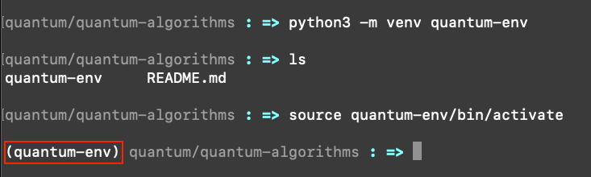

# quantum-algorithms

A Python repository to explore quantum circuit design and algorithms using IBM Qiskit.

## Purpose

I created this repository to study foundational quantum circuit design and quantum algorithms using Python and IBM's Qiskit software.

## Key Topics

• qiskit fundamentals

• single-qubit gates

• GHZ (Greenberger-Horne-Zellinger) 3-qubit maximally entangled state

• Deutsch-Jozsa algorithm

• Bernstein-Vazirani algorithm

## Prerequisites

IBM Quantum account - [quantum.ibm.com](quantum.ibm.com)

This account provides access to real quantum hardware and the IBM Quantum Lab.

## Python Setup

### Versions

1. `python` - currently v3.14

    ```bash
    which python3
    ```

1. `pip3` - python package manager, currently v26.0.1

    ```bash
    pip3 --version
    ```

### Create Virtual Environment

Create a `quantum-env` virtual environment for this work.  This will keep quantum packages isolated from other Python projects and avoids version conflicts.

If something breaks, you can delete the environment and start fresh without affecting anything else on your system.  This is a standard Python best practice.

The following commands create a folder called `quantum-env` in this repository containing an isolated Python installation.

```bash
python3 -m venv quantum-env
source quantum-env/bin/activate
```

Once activated, the terminal prompt changes to show the environment name:



#### Check Environment Path

Run this command to show the list of directory paths that Python searches _in order_ when it reads an `import` statement in code:

```bash
python3 -c "import sys; print(sys.path)"
```

When `quantum-env` is activated, the output will show a directory path to it:

```bash
['', '/Library/Frameworks/Python.framework/Versions/3.14/lib/python314.zip', '/Library/Frameworks/Python.framework/Versions/3.14/lib/python3.14', '/Library/Frameworks/Python.framework/Versions/3.14/lib/python3.14/lib-dynload', '/Users/jstowers/Documents/Personal/quantum/quantum-algorithms/quantum-env/lib/python3.14/site-packages']
```

### Install Qiskit Dependencies

1. As separate commands, or
```bash
pip3 install qiskit
pip3 install qiskit-aer
pip3 qiskit-ibm-runtime
pip3 install matplotlib
pip3 install pylatexenc
```

2. As a single command:
```bash
pip3 install qiskit qiskit-aer qiskit-ibm-runtime matplotlib pylatexenc
```

Verify a successful installation of a particular package with the following command.  Here, this command checks for `qiskit` and its installed version:

```bash
python3 -c "import qiskit; print(qiskit.__version__)"
```

#### Current Versions

1. `qiskit` - v2.3.0

1. `qiskit-aer` - v0.17.2

1. `qiskit-ibm-runtime` - v0.45.1

1. `matplotlib` - v3.10.8

1. `pylatexenc` - v2.10

#### Save Environment File

Run this command to save the entire environment to the `requirements.txt` file:

```bash
pip3 freez > requirements.txt
```

From here, anyone can recrate the exact `quantum-env` environment with this command:

```bash
pip3 install -r requirements.txt
```

### Daily Workflow

To use the `quantum-env` virtual environment, you must activate and deactivate the environment every session:

```bash
# 1. navigate to this project folder
cd quantum/quantum-algorithms

# 2. activate the environment
source quantum-env/bin/activate

# 3. work on project - write scripts, run code
python3 grover.py

# 4 deactivate environment when done
deactivate
```
The `deactivate` command returns your command prompt to normal.

## Initial Commit

Sunday, March 8, 2026

## Last Revision

Sunday, March 8, 2026
